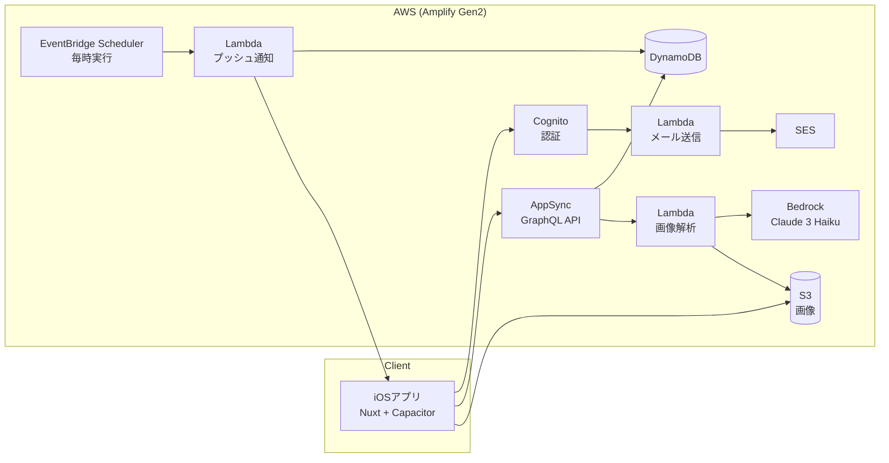

# Beautify

化粧品・スキンケア用品の在庫と使用量を管理するiOSアプリです。
「いつ使い切るか」を把握できるようにし、買い忘れや買いすぎを防ぐことを目的に、企画からリリース・運用まで個人で開発しました。

> App Storeにて期間限定で配信しました（運用コストを考慮した計画的な配信で、現在は配信終了）。

## 主な機能

| 機能 | 内容 |
|---|---|
| パッケージ画像からの自動入力 | 製品パッケージを撮影すると、Amazon Bedrock（Claude 3 Haiku）でブランド名・製品名・容量を読み取り、登録フォームに反映 |
| 残量の自動計算 | 1回あたりの使用量と1日の使用回数をもとに、残量を自動で減算 |
| 残量通知 | ユーザーが指定した時刻にプッシュ通知でお知らせ |
| アカウント管理 | メールアドレスによるサインアップ・ログイン、登録完了やパスワード変更時のメール送信 |

## アーキテクチャ



- フロントエンドはNuxt（SPAモード）で構築し、Capacitorでネイティブアプリ化しています。
- バックエンドはAmplify Gen2でコードとして定義し、サーバーレス構成にしています。
- 通知はEventBridge Schedulerで毎時Lambdaを起動し、ユーザーごとに設定された時刻に該当する場合のみ送信します。

## 技術スタック

| 分類 | 技術 |
|---|---|
| フロントエンド | Nuxt 4, Vue 3, TypeScript |
| モバイル | Capacitor 8（iOS） |
| バックエンド | AWS Amplify Gen2（Cognito, AppSync, DynamoDB, S3, Lambda） |
| AI | Amazon Bedrock（Claude 3 Haiku） |
| 通知・メール | EventBridge Scheduler, Push Notifications, Amazon SES |
| CI/CD | GitHub Actions, Amplify Hosting |
| 開発支援 | Claude Code |

## 開発の進め方

業務で経験している上流工程の進め方を取り入れ、設計を固めてから実装に入りました。

1. **モックアップ作成**：Claude Codeでコード生成前に画面のモックアップを作成
2. **要件定義・基本設計**：モックアップをもとに機能・画面・データ構造を整理
3. **実装**：設計が固まった段階でClaude Codeによるコード生成に進み、実装

## CI/CD

| ワークフロー | トリガー | 内容 |
|---|---|---|
| `ci.yml` | `main` へのPull Request | 型チェック（`nuxt typecheck`）、ビルド検証（`nuxt generate`） |
| `deploy.yml` | `main` へのpush | Amplify Gen2バックエンドのデプロイ（`ampx pipeline-deploy`）。フロントエンドはAmplify Hostingが自動でビルド・デプロイ |

## ローカル環境での起動

```bash
# 依存関係のインストール
npm install

# Amplifyサンドボックス（個人用のバックエンド環境）を起動
npx ampx sandbox

# 開発サーバーを起動（http://localhost:3000）
npm run dev
```

### iOSアプリとしてビルド

```bash
npm run generate
npx cap sync ios
npx cap open ios
```

## 振り返り

配信期間中、ユーザー数は大きく伸びませんでした。機能面の要件は事前に固めた一方で、アプリの目的やターゲットの設定が不十分だったこと、広告などの集客施策を行わなかったことが要因だと考えています。
次回の開発では、目的とターゲットを事前に定めたうえで設計に入り、実際に使われるアプリづくりに取り組みます。
